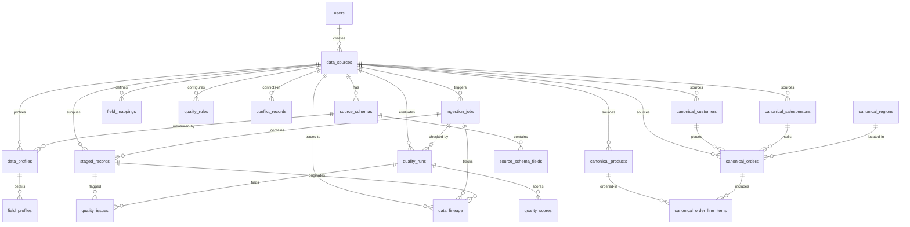

# SalesLens Database Schema

## ER Diagram



---

## Table Reference

### 1. `users`
**Purpose:** Authentication — stores registered users who operate the system.
**Key columns:**
- `id` BIGSERIAL PK — auto-increment, internal-only
- `username` UNIQUE — login identifier
- `email` UNIQUE — login identifier
- `password` — BCrypt hash
- `role` — authority level (ADMIN / ANALYST)

**Constraints:** Unique on username and email. No user can exist without both.

---

### 2. `data_sources`
**Purpose:** Registry of every data source the system ingests from — files, databases, Kafka streams.
**Key columns:**
- `id` UUID PK — referenced by almost every other table
- `source_type` — CSV_FILE, EXCEL_FILE, JDBC_POSTGRES, JDBC_MYSQL, KAFKA_STREAM
- `trust_score` (0.0–1.0) — used in conflict resolution (higher trust wins)
- `connection_config` JSONB — source-specific config (JDBC URL, Kafka topic, credentials)
- `active` BOOLEAN — toggle without deleting source config

**FK:** `created_by` → users(id). A source without a creator is orphaned data.

---

### 3. `source_schemas`
**Purpose:** Versioned record of what columns a source contains and their inferred types. Each ingestion or schema drift creates a new version.
**Key columns:**
- `version` INTEGER — increments on schema change
- `status` — ACTIVE or SUPERSEDED

**FK:** `source_id` → data_sources(id). One source → many schema versions.

---

### 4. `source_schema_fields`
**Purpose:** Individual field definitions within a schema version — name, inferred type, format pattern, nullability.
**Key columns:**
- `inferred_type` — INTEGER, DECIMAL, DATE, EMAIL, FREE_TEXT, etc.
- `detected_format` — date pattern like "yyyy-MM-dd" if applicable
- `sample_values` JSONB — representative values for debugging

**FK:** `schema_id` → source_schemas(id). One schema → many fields.

---

### 5. `ingestion_jobs`
**Purpose:** Tracks every ingestion run — status, timing, record counts at each pipeline stage.
**Key columns:**
- `status` — PENDING → RUNNING → COMPLETED / PARTIAL / FAILED
- `total_read`, `total_transformed`, `total_quality_pass/fail`, `total_loaded`, `total_conflicted` — pipeline counters
- `error_message` TEXT — set when job fails

**FK:** `source_id` → data_sources(id). One source → many jobs (one per ingestion run).

---

### 6. `staged_records`
**Purpose:** Raw ingested data before any transformation — the landing zone. Everything starts here.
**Key columns:**
- `raw_payload` JSONB — entire source row as-is (column_name → value)
- `record_hash` SHA-256 — for deduplication
- `row_number` — original position in file

**FK:** `job_id` → ingestion_jobs(id), `source_id` → data_sources(id). Every staged record knows exactly which ingestion run and source produced it.

---

### 7. `field_mappings`
**Purpose:** Maps source fields to canonical fields with a confidence score. Low-confidence mappings require user confirmation before data flows.
**Key columns:**
- `source_field_name` — the original name in the source
- `canonical_entity`, `canonical_field` — where it maps to (e.g., customer.name)
- `confidence` (0.0–1.0) — computed by the semantic mapper
- `status` — AUTO_CONFIRMED (≥ 0.80), PENDING (< 0.80), IGNORED
- `transform_rule` — RENAME, TYPE_CAST, FORMAT_NORMALIZE, etc.

**FK:** `source_id` → data_sources(id). One source → many field mappings.

---

### 8. `data_profiles`
**Purpose:** Statistical snapshot of a source's data at a point in time — used as baseline for drift detection.
**Key columns:**
- `total_records` — how many rows were profiled

**FK:** `source_id` → data_sources(id), `schema_id` → source_schemas(id), `job_id` → ingestion_jobs(id).

---

### 9. `field_profiles`
**Purpose:** Per-field statistics within a profile — null rate, cardinality, value distribution.
**Key columns:**
- `null_rate` (0.0000–1.0000) — fraction of records where this field is null
- `unique_count` — distinct values
- `top_values` JSONB — most common values
- `min_value`, `max_value` — for numeric fields

**FK:** `profile_id` → data_profiles(id). One profile → many field profiles.

---

### 10. `quality_rules`
**Purpose:** Configurable rules that define what "good data" means per source. Users can add rules via API without redeployment.
**Key columns:**
- `dimension` — COMPLETENESS, VALIDITY, UNIQUENESS, CONSISTENCY, TIMELINESS, ACCURACY
- `rule_code` — machine-readable identifier
- `severity` — LOW / MEDIUM / HIGH / CRITICAL
- `config` JSONB — rule parameters (thresholds, reference sets)
- `active` BOOLEAN — enable/disable without deleting

**FK:** `source_id` → data_sources(id) — nullable (global rules apply to all sources).

---

### 11. `quality_runs`
**Purpose:** Each evaluation of a job's staged records → one quality run. Tracks total records and issue count.
**Key columns:**
- `total_records`, `total_issues` — summary counts

**FK:** `job_id` → ingestion_jobs(id), `source_id` → data_sources(id).

---

### 12. `quality_scores`
**Purpose:** Per-dimension scores (0.0–1.0) plus overall score and letter grade for a quality run.
**Key columns:**
- `dimension` — which dimension this score is for
- `score` (0.0000–1.0000)
- `overall_score` — weighted combination of all dimensions
- `grade` — A (≥ 0.95), B (≥ 0.85), C (≥ 0.70), D (≥ 0.55), F (< 0.55)

**FK:** `run_id` → quality_runs(id), `source_id` → data_sources(id).

---

### 13. `quality_issues`
**Purpose:** Every data quality violation. Each row = one field that failed one rule in one record.
**Key columns:**
- `dimension`, `rule_code` — what failed
- `severity` — LOW / MEDIUM / HIGH / CRITICAL
- `field_name`, `field_value` — the offending data
- `message` — human-readable explanation
- `status` — OPEN or ACKNOWLEDGED

**FK:** `run_id` → quality_runs(id), `record_id` → staged_records(id). Links the issue back to the exact stale raw record.

---

### 14. `conflict_records`
**Purpose:** Cross-source disagreements on entity field values. Immutable record of "Source A said X, Source B said Y."
**Key columns:**
- `entity_type`, `entity_id` — what entity conflicts
- `field_name` — which field disagrees
- `value_a`, `value_b` — both sides' values
- `resolution_strategy` — TRUST_HIERARCHY, LATEST_WINS, FLAGGED_FOR_REVIEW
- `status` — OPEN, RESOLVED, SUPPRESSED

**FK:** `source_a_id`, `source_b_id` → data_sources(id). `resolved_by` → users(id). Each conflict knows exactly which two sources disagreed and who resolved it.

---

### 15. `canonical.customers`
**Purpose:** Unified customer records. One row per real-world customer, regardless of how many sources describe them.
**Key columns:**
- `external_refs` JSONB — {"crm":"C-123", "erp":"1045"} — each source's ID for this customer
- `segment`, `region`, etc. — resolved values (may come from different sources)
- `primary_source` — which source the resolved values came from
- `quality_score` (0.0000–1.0000)
- `has_conflicts` BOOLEAN — true when unresolved conflicts exist

---

### 16. `canonical.products`
**Purpose:** Unified product catalog. Same merge semantics as customers.
**Key columns:**
- `sku`, `name`, `category`, `sub_category`
- `unit_price` DECIMAL(12,4)
- `currency` CHAR(3) — ISO-4217
- `active` BOOLEAN

---

### 17. `canonical.salespersons`
**Purpose:** Unified salesperson/rep records.
**Key columns:**
- `team`, `territory`, `region`
- `active` BOOLEAN

---

### 18. `canonical.regions`
**Purpose:** Static region lookup table — not merged from sources, maintained within the system.
**Key columns:**
- `name` — region name
- `country`, `zone`

---

### 19. `canonical.orders`
**Purpose:** Unified sales orders.
**Key columns:**
- `order_date`, `ship_date`
- `total_amount` DECIMAL(12,4)
- `currency` CHAR(3)
- `shipping_cost` DECIMAL(12,4)
- `source_id` — which source's version of this order was loaded
- `job_id` — which ingestion job loaded it
- `has_conflicts` BOOLEAN

**FK:** `customer_id` → canonical.customers, `salesperson_id` → canonical.salespersons, `region_id` → canonical.regions, `source_id` → data_sources, `job_id` → ingestion_jobs.

---

### 20. `canonical.order_line_items`
**Purpose:** Line items within an order — the atomic sales unit.
**Key columns:**
- `quantity` INTEGER
- `unit_price` DECIMAL(12,4)
- `discount` DECIMAL(5,4)
- `line_total` DECIMAL(12,4) — should equal quantity × unit_price - discount

**FK:** `order_id` → canonical.orders, `product_id` → canonical.products.

---

### 21. `data_lineage`
**Purpose:** Tracks every canonical record back to its source record and the transformations applied. Enables full audit trail.
**Key columns:**
- `canonical_id`, `canonical_type` — which canonical record (polymorphic — any table in canonical schema)
- `transformations` JSONB — ordered array of [{step, from_field, to_field, rule, input, output}]

**FK:** `source_id` → data_sources(id), `job_id` → ingestion_jobs(id), `staged_id` → staged_records(id). Every lineage record traces back through the entire pipeline.

---

## Relationship Summary

```
users ──creates──→ data_sources ──────────────→ (everything else)
                         │
                    [source of truth for:
                     connection config, trust score,
                     active/inactive state]

staged_records ──feeds──→ quality_runs ──finds──→ quality_issues
                ──feeds──→ data_profiles ──has──→ field_profiles
                ──mapped-by──→ field_mappings

quality_issues + conflict_records ──both──→ canonical tables
                                  (with lineage recording every step)

canonical.* ──queried-by──→ external tools (Tableau, Grafana, psql)
```
